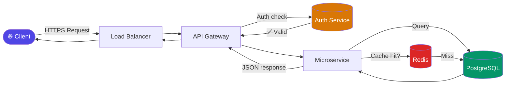
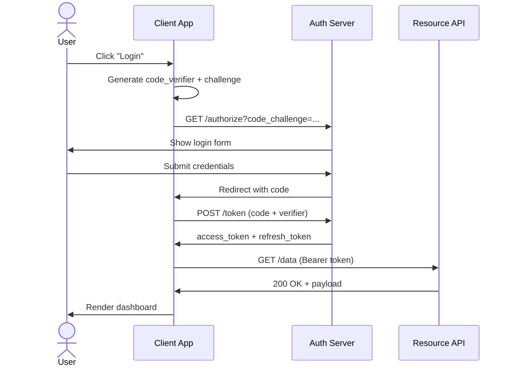
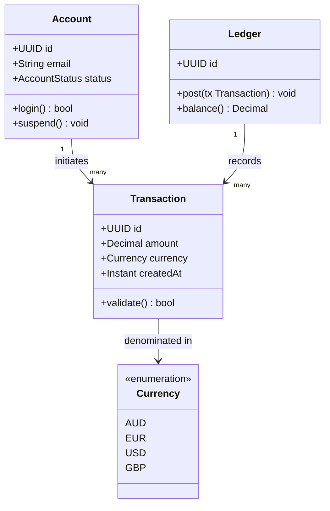
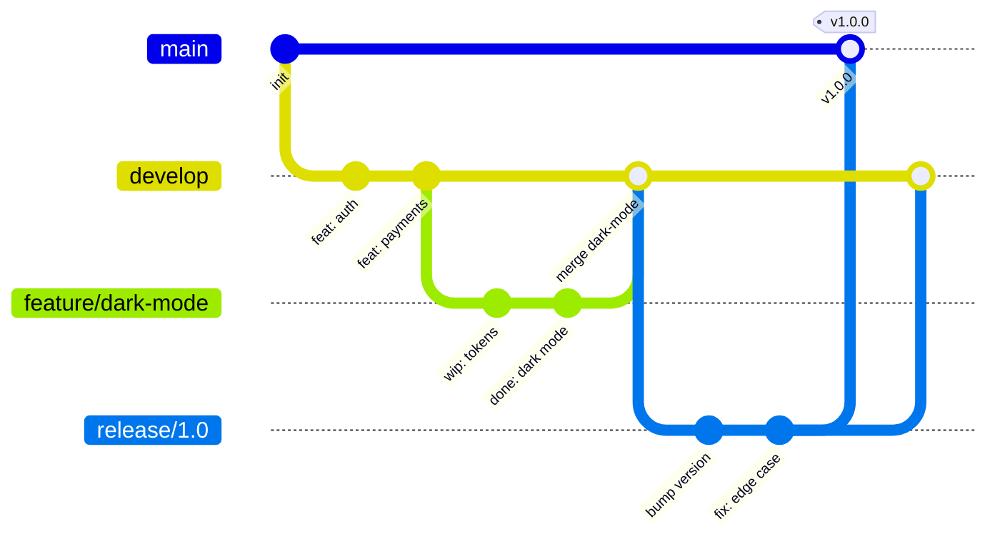
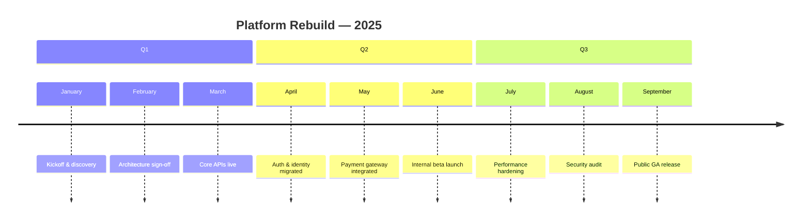

# Mermaid Examples

## 1. Flowchart — HTTP Request Lifecycle

## 2. Sequence Diagram — OAuth2 PKCE Flow

## 3. Class Diagram — Domain Model

## 4. Git Graph — Release Branching

## 5. Timeline — Project Milestones

