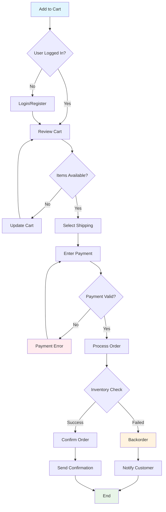

```mermaid

graph TB
    A[Add to Cart] --> B{User Logged In?}
    B -->|No| C[Login/Register]
    B -->|Yes| D[Review Cart]
    C --> D
    D --> E{Items Available?}
    E -->|No| F[Update Cart]
    F --> D
    E -->|Yes| G[Select Shipping]
    G --> H[Enter Payment]
    H --> I{Payment Valid?}
    I -->|No| J[Payment Error]
    J --> H
    I -->|Yes| K[Process Order]
    K --> L{Inventory Check}
    L -->|Failed| M[Backorder]
    L -->|Success| N[Confirm Order]
    M --> O[Notify Customer]
    N --> P[Send Confirmation]
    O --> Q[End]
    P --> Q
    
    style A fill:#e1f5fe
    style Q fill:#e8f5e8
    style J fill:#ffebee
    style M fill:#fff3e0

```
