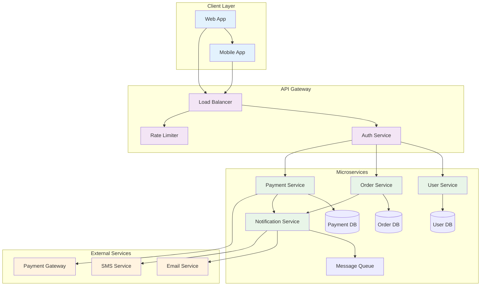

```mermaid

graph TB
    subgraph "Client Layer"
        A[Web App] --> B[Mobile App]
    end
    
    subgraph "API Gateway"
        C[Load Balancer] --> D[Auth Service]
        C --> E[Rate Limiter]
    end
    
    subgraph "Microservices"
        F[User Service] --> G[(User DB)]
        H[Order Service] --> I[(Order DB)]
        J[Payment Service] --> K[(Payment DB)]
        L[Notification Service] --> M[Message Queue]
    end
    
    subgraph "External Services"
        N[Payment Gateway]
        O[Email Service]
        P[SMS Service]
    end
    
    A --> C
    B --> C
    D --> F
    D --> H
    D --> J
    H --> L
    J --> L
    J --> N
    L --> O
    L --> P
    
    classDef client fill:#e3f2fd
    classDef gateway fill:#f3e5f5
    classDef service fill:#e8f5e8
    classDef external fill:#fff3e0
    
    class A,B client
    class C,D,E gateway
    class F,H,J,L service
    class N,O,P external

```
