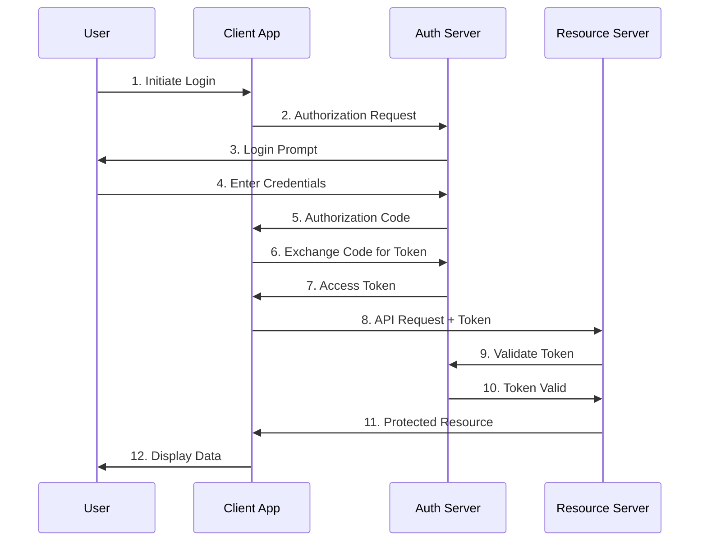

```mermaid

sequenceDiagram
    participant U as User
    participant C as Client App
    participant A as Auth Server
    participant R as Resource Server
    
    U->>C: 1. Initiate Login
    C->>A: 2. Authorization Request
    A->>U: 3. Login Prompt
    U->>A: 4. Enter Credentials
    A->>C: 5. Authorization Code
    C->>A: 6. Exchange Code for Token
    A->>C: 7. Access Token
    C->>R: 8. API Request + Token
    R->>A: 9. Validate Token
    A->>R: 10. Token Valid
    R->>C: 11. Protected Resource
    C->>U: 12. Display Data

```
