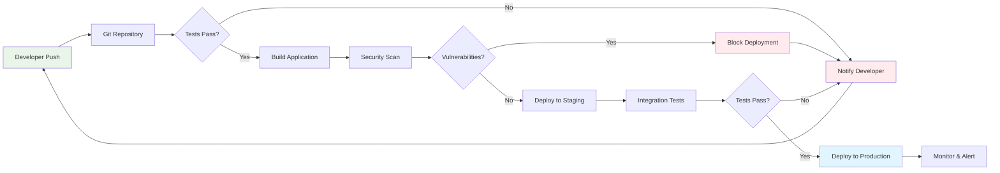

```mermaid

graph LR
    A[Developer Push] --> B[Git Repository]
    B --> C{Tests Pass?}
    C -->|No| D[Notify Developer]
    D --> A
    C -->|Yes| E[Build Application]
    E --> F[Security Scan]
    F --> G{Vulnerabilities?}
    G -->|Yes| H[Block Deployment]
    H --> D
    G -->|No| I[Deploy to Staging]
    I --> J[Integration Tests]
    J --> K{Tests Pass?}
    K -->|No| D
    K -->|Yes| L[Deploy to Production]
    L --> M[Monitor & Alert]
    
    style A fill:#e8f5e8
    style L fill:#e1f5fe
    style D fill:#ffebee
    style H fill:#ffebee

```
