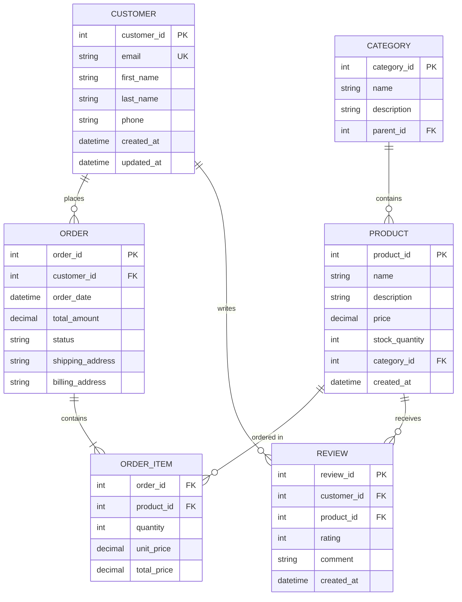

```mermaid

erDiagram
    CUSTOMER ||--o{ ORDER : places
    CUSTOMER {
        int customer_id PK
        string email UK
        string first_name
        string last_name
        string phone
        datetime created_at
        datetime updated_at
    }
    
    ORDER ||--|{ ORDER_ITEM : contains
    ORDER {
        int order_id PK
        int customer_id FK
        datetime order_date
        decimal total_amount
        string status
        string shipping_address
        string billing_address
    }
    
    PRODUCT ||--o{ ORDER_ITEM : "ordered in"
    PRODUCT {
        int product_id PK
        string name
        string description
        decimal price
        int stock_quantity
        int category_id FK
        datetime created_at
    }
    
    CATEGORY ||--o{ PRODUCT : contains
    CATEGORY {
        int category_id PK
        string name
        string description
        int parent_id FK
    }
    
    ORDER_ITEM {
        int order_id FK
        int product_id FK
        int quantity
        decimal unit_price
        decimal total_price
    }
    
    CUSTOMER ||--o{ REVIEW : writes
    PRODUCT ||--o{ REVIEW : receives
    REVIEW {
        int review_id PK
        int customer_id FK
        int product_id FK
        int rating
        string comment
        datetime created_at
    }

```
