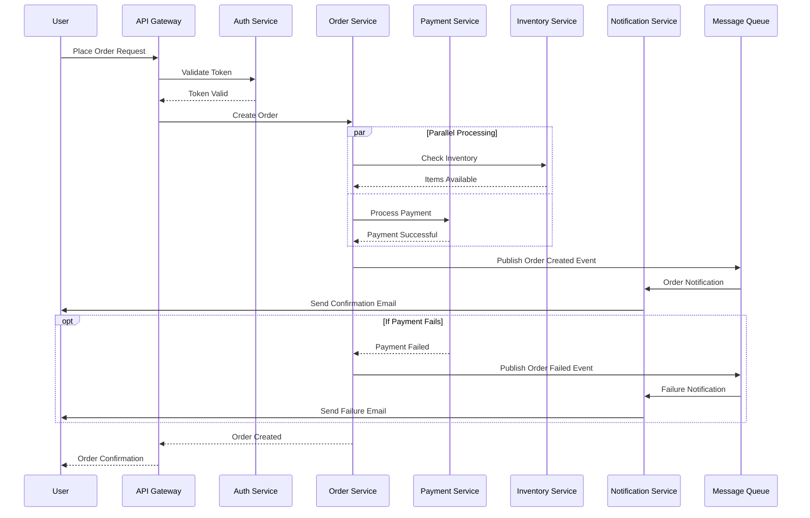

```mermaid

sequenceDiagram
    participant U as User
    participant G as API Gateway
    participant A as Auth Service
    participant O as Order Service
    participant P as Payment Service
    participant I as Inventory Service
    participant N as Notification Service
    participant Q as Message Queue
    
    U->>G: Place Order Request
    G->>A: Validate Token
    A-->>G: Token Valid
    G->>O: Create Order
    
    par Parallel Processing
        O->>I: Check Inventory
        I-->>O: Items Available
    and
        O->>P: Process Payment
        P-->>O: Payment Successful
    end
    
    O->>Q: Publish Order Created Event
    Q->>N: Order Notification
    N->>U: Send Confirmation Email
    
    opt If Payment Fails
        P-->>O: Payment Failed
        O->>Q: Publish Order Failed Event
        Q->>N: Failure Notification
        N->>U: Send Failure Email
    end
    
    O-->>G: Order Created
    G-->>U: Order Confirmation

```
