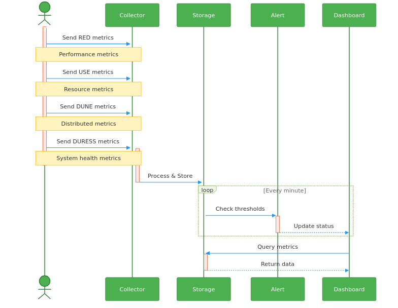
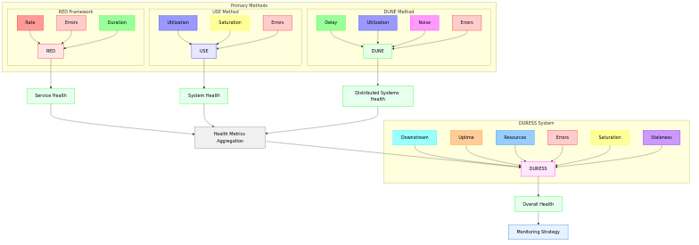

# mermaid

**Render [Mermaid](https://mermaid.js.org/) diagrams from Markdown to SVG, PNG, or PDF without installing Node.js or npm.** A lightweight shell function (compatible with **bash** and **zsh**) scans every ` ```mermaid ` fenced block in a Markdown file and renders each one to a numbered image using the official [`minlag/mermaid-cli`](https://hub.docker.com/r/minlag/mermaid-cli) Docker image, producing a companion Markdown file with diagram code replaced by standard image references.

Suitable for local development, CI pipelines, documentation workflows, and [Claude Code](https://claude.ai/code) environments via the included [/mermaid](.claude/skills/mermaid/) slash command skill.

After each ```` ```mermaid ```` fenced block in your input file is extracted and rendered to an image (SVG, PNG, or PDF), the output is a new Markdown file with the diagram code blocks replaced by `` image references, plus the rendered image files alongside it.

---

## Requirements

- **Docker** installed and running locally (not required in Claude Code sandbox — see [Claude Code skill](#claude-code-skill))
- **bash** (3.2+) or **zsh**

---

## Installation

```bash
git clone https://github.com/rondomondo/mermaid.git
cd mermaid
make install        # copies mermaid.sh to /usr/local/bin and adds source line to your shell profile
source ~/.bashrc     # or ~/.zshrc — reload whichever profile make install updated
```

To install to a different directory:

```bash
make install INSTALL_DIR=~/bin
```

> `mermaid` is a **shell function**, not a standalone executable — it must be sourced into your shell session. `make install` handles this automatically.

Verify the install worked:

```bash
make check
```

---

## Quick start

```bash
mermaid examples/example.md        # renders to SVG (default)
make test                      # smoke-test: renders example.md as SVG and PNG
```

---

## Usage

```bash
mermaid <input.md> [options]

Options:
  -f, --format <fmt>    Output format: svg (default), png, pdf
  -t, --theme <theme>   Mermaid theme: default, dark, forest, neutral
  -b, --bg <color>      Background colour (e.g. white, transparent, '#f5f5f5')
  -w, --width <px>      Diagram width in pixels
  -H, --height <px>     Diagram height in pixels
  -s, --scale <n>       Pixel density / scale factor (default 1)
  -d, --dir <dir>       Host directory to mount (defaults to directory of input file)
  -h, --help            Show this help
```

---

## Examples

### SVG output (default)

```bash
mermaid examples/example.md
```

### PNG at a custom resolution

```bash
mermaid examples/example.md --format png --width 960 --height 640
```

Example output:

```
mermaid: rendering 'example.md' → 'example.png.md' (png)
Found 6 mermaid charts in Markdown input
 ✅ ./example.png-1.png
 ✅ ./example.png-2.png
 ✅ ./example.png-3.png
 ✅ ./example.png-4.png
 ✅ ./example.png-5.png
 ✅ ./example.png-6.png
 ✅ /examples/example.png.md
mermaid: written → /Users/davek/Code/mermaid/examples/example.png.md
```

### PNG with dark theme and high pixel density

```bash
mermaid examples/example.md -f png -t dark -s 3
```

### SVG with a transparent background, wide canvas

```bash
mermaid examples/example.md -f svg -b transparent -w 1920
```

### PNG with a coloured background - slate

```bash
mermaid examples/example.md --format png --width 640 --height 480 --bg '#99aacc'
```

### PDF export

```bash
mermaid examples/example.md --format pdf
```

---

## Output files

For an input file `examples/example.md` rendered as PNG the function writes:

| File | Description |
|---|---|
| `examples/example.png-1.png` | First rendered diagram |
| `examples/example.png-2.png` | Second rendered diagram |
| … | … |
| `examples/example.png.md` | Updated Markdown with `` image links |

The original `.md` file is **not modified**.

---

## How it works

1. The function resolves the absolute path of the input file and mounts its parent directory into the Docker container at `/data`.
2. `minlag/mermaid-cli` iterates over every ```` ```mermaid ```` block in the file and renders each one to a numbered image file.
3. It writes a companion Markdown file (e.g. `example.png.md`) where the code blocks are replaced with standard `` image references — ready to embed in GitHub, GitLab, Notion, or any Markdown renderer that serves local images.
4. The container runs as the current user (`-u $(id -u):$(id -g)`) so all output files are owned by you, not root.

---

## Themes

| Theme | Description |
|---|---|
| `default` | Light, clean (default if omitted) |
| `dark` | Dark background |
| `forest` | Green-toned |
| `neutral` | Greyscale, print-friendly |

---

## Claude Code skill

If you use [Claude Code](https://claude.ai/code), this repository ships a `/mermaid` slash command skill that lets Claude render your diagrams for you — no terminal required.

### Render environments

The skill automatically detects which render path to use:

| Environment | How it renders |
|---|---|
| **Claude Code sandbox** (`IS_SANDBOX=yes`) | Uses `mmdc` directly with a bundled Chromium — no Docker needed |
| **Local / non-sandbox** | Uses the `mermaid` shell function backed by Docker (`minlag/mermaid-cli`) |

You don't need to do anything differently — the skill picks the right path automatically.

### What it accepts

The skill handles three input types:

| Input | Example |
|---|---|
| Single file | `examples/example.md` |
| Local directory | `./docs/` — renders every `.md` with a mermaid block |
| URL (file) | `https://example.com/diagram.md` |
| URL (GitHub directory) | `https://github.com/user/repo/tree/main/docs` |

### Ways to invoke the skill

**Slash command** — type directly in the Claude Code prompt:

```
/mermaid examples/example.md
/mermaid examples/example.md -f png -s 2
/mermaid ./docs/ -f svg -t dark
/mermaid https://github.com/user/repo/tree/main/docs
```

**Drag and drop / attach** — drag a `.md` file (or a folder) onto the Claude Code chat input, then ask:

```
Render the diagrams in this file as PNG
```

```
Export all mermaid diagrams to SVG with a transparent background
```

**Natural language** — just describe what you want:

```
Can you render the mermaid diagrams in examples/example.md?
```

```
Export the diagrams in ./docs/ to PNG at 2× scale
```

```
Generate SVG images from the mermaid blocks at https://github.com/user/repo/tree/main/docs
```

Claude will invoke the skill automatically when it detects a render request.

### Installing the skill

The skill lives in [.claude/skills/mermaid/](.claude/skills/mermaid/) inside this repository. Claude Code loads skills from a `.claude/skills/` directory in your **project root**.

**Option 1 — make target (recommended if you have a local clone):**

```bash
make skill-install   # copies .claude/skills/mermaid/ into ~/.claude/skills/mermaid/
```

**Option 2 — download just the skill file:**

```bash
mkdir -p .claude/skills/mermaid
curl -fsSL \
  https://raw.githubusercontent.com/rondomondo/mermaid/main/.claude/skills/mermaid/SKILL.md \
  -o .claude/skills/mermaid/SKILL.md
```

**Option 3 — copy from a local clone:**

```bash
cp /path/to/mermaid/.claude/skills/mermaid/SKILL.md .claude/skills/mermaid/SKILL.md
```

**Option 4 — grab the zip** (includes SKILL.md and helper scripts):

Download [.claude/skills/mermaid.zip](.claude/skills/mermaid.zip) and unzip into your project's `.claude/skills/` directory.

After installing, restart Claude Code so the skill is loaded.

> **Before copying**, open `SKILL.md` and review the `allowed-tools` frontmatter — it declares exactly which tools the skill may use.

### Non-sandbox: Docker required

Outside the sandbox, the skill uses the `mermaid` shell function. Make sure it is sourced (see [Installation](#installation)) and Docker is running. If either is missing the skill will tell you exactly what to fix.

---

## Sample output

The [examples/example.png.md](examples/example.png.md) file was produced by running:

```bash
mermaid examples/example.md --format png --width 960 --height 640
```

### Example Rendered Diagrams - [SRE Common Diagrams](examples/example.png.md)



<br>

## Relationship between frameworks



---

## Tips

- Use `--scale 2` or `--scale 3` for retina/HiDPI PNG exports.
- Combine `--bg transparent` with SVG output for diagrams you embed in dark-mode docs.
- The `--dir` flag lets you mount a different directory if your assets span multiple folders.
- Run `mermaid -h` at any time to print the built-in help.

